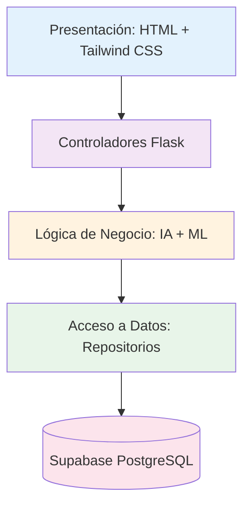
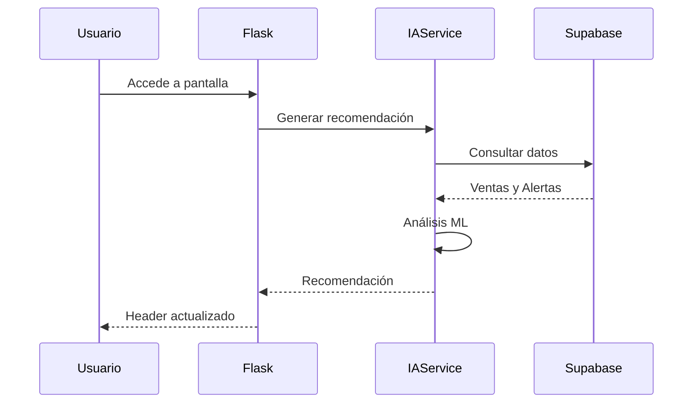
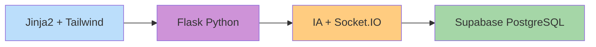
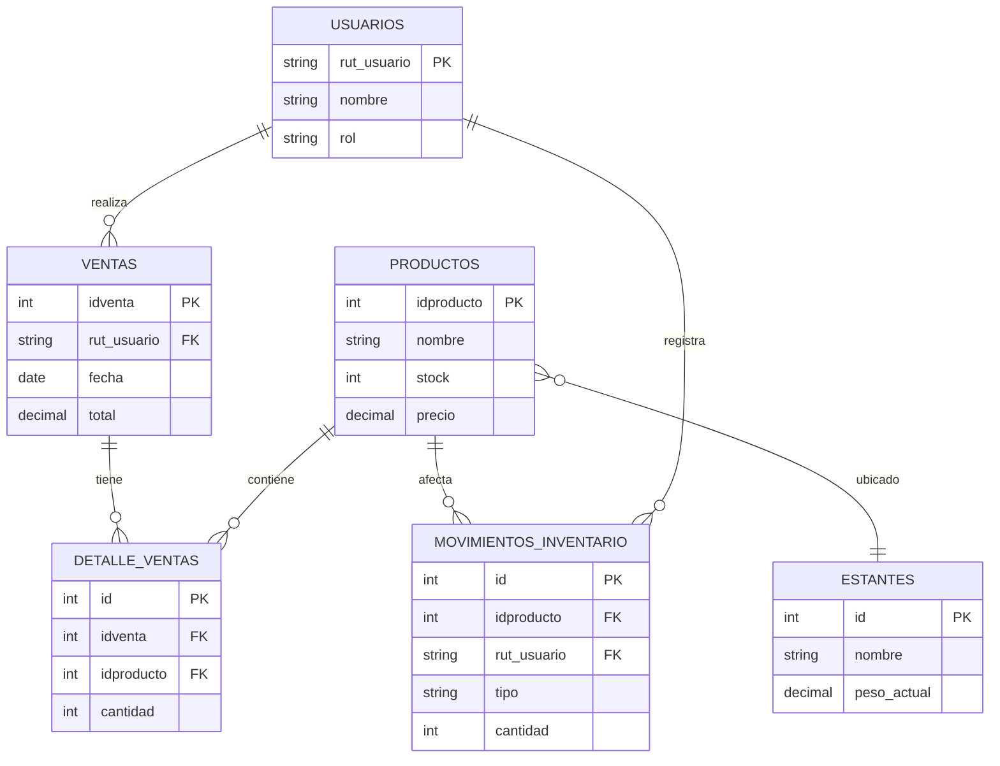
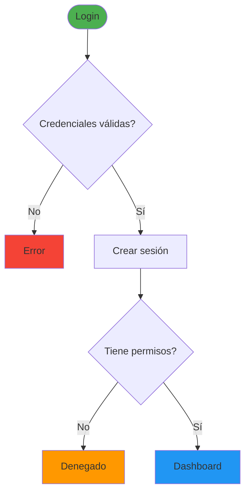
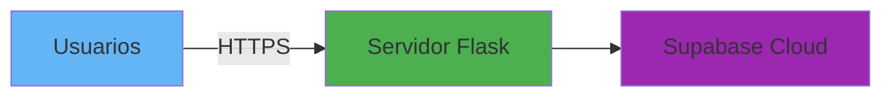
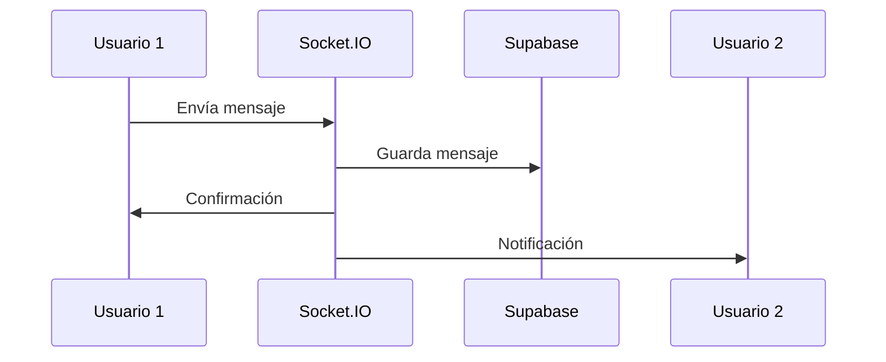

# Diagramas de Arquitectura - Sistema Weigence

## 1. Arquitectura en Capas

---

## 2. Flujo de Recomendaciones IA

---

## 3. Stack Tecnológico

---

## 4. Modelo de Datos Principal

---

## 5. Flujo de Autenticación

---

## 6. Arquitectura de Despliegue

---

## 7. Chat en Tiempo Real

---

## Instrucciones

### Para insertar en Word:
1. Ir a https://mermaid.live
2. Copiar código del diagrama
3. Exportar como PNG o SVG
4. Insertar en Word como imagen
5. Numerar: "Figura 6.1: Arquitectura del Sistema Weigence"
