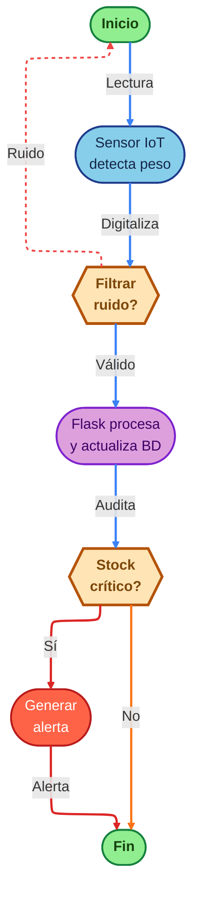
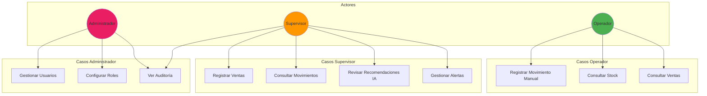
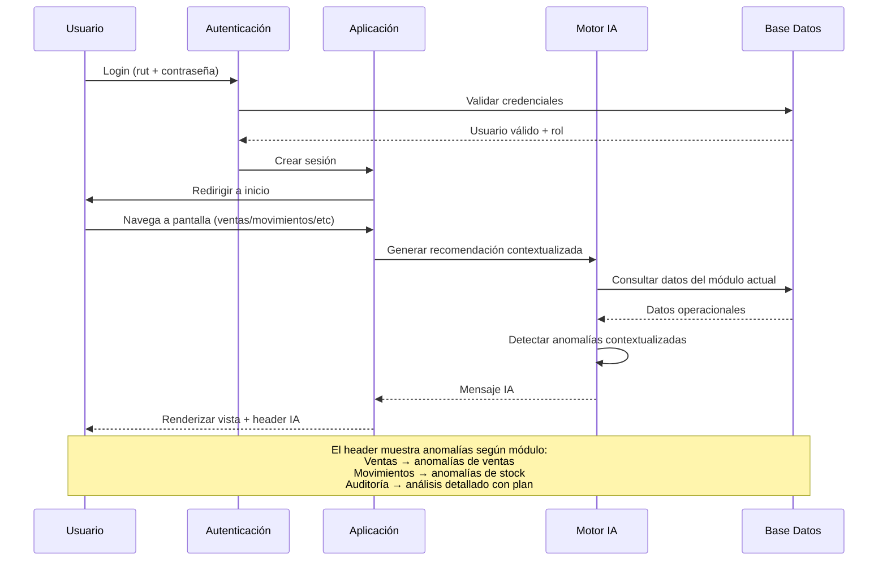
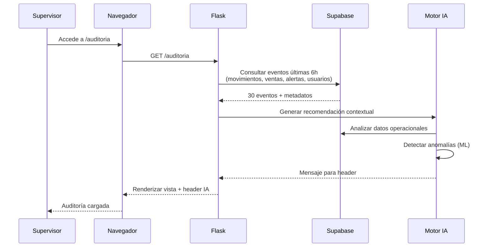
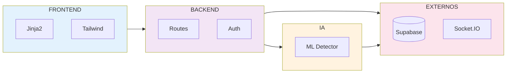
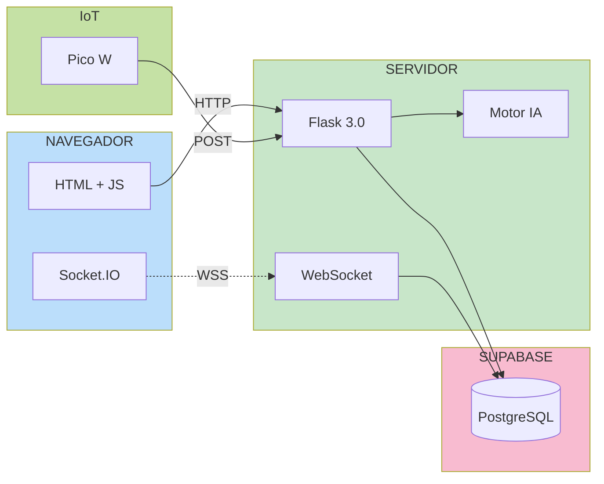
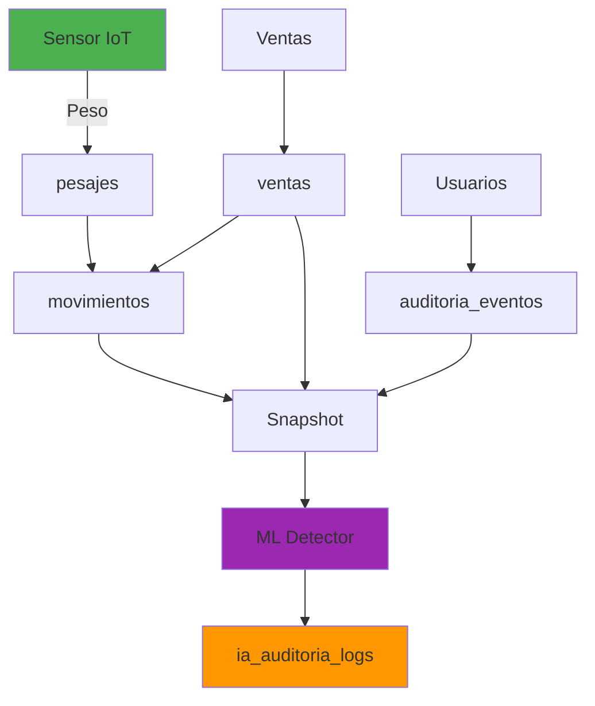
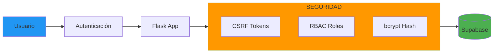

# Diagramas Punto 9 - Detalle de Arquitectura a Implementar

## 1. BPMN - Proceso de Gestión de Inventario

El siguiente diagrama modela el proceso de negocio principal: la detección y registro de variaciones de inventario. A diferencia de un flujo manual tradicional, aquí se destaca la automatización del ingreso de datos mediante el sensor IoT y el filtrado inteligente de ruido.

---

## 2. Casos de Uso - Roles del Sistema

---

## 3. Flujo de Interacción Usuario-Sistema

---

## 4. Flujo Asistente IA - Auditoría

---

## 5. Diagrama de Componentes

---

## 6. Topología de Componentes

---

## 7. Flujo de Datos - Pipeline IA

---

## 8. Seguridad Implementada

---

## Instrucciones de Uso

### Para Word:
1. Copiar cada código Mermaid a https://mermaid.live
2. Exportar como PNG (alta resolución)
3. Insertar en documento numerando:
   - Figura 9.1: BPMN Proceso de Venta
   - Figura 9.2: Diagrama de Casos de Uso
   - Figura 9.3: Flujo de Interacción Usuario-Sistema
   - Figura 9.4: Flujo Asistente IA - Auditoría
   - Figura 9.5: Diagrama de Componentes
   - Figura 9.6: Topología de Componentes
   - Figura 9.7: Arquitectura de Datos ETL
   - Figura 9.8: Infraestructura y Seguridad
